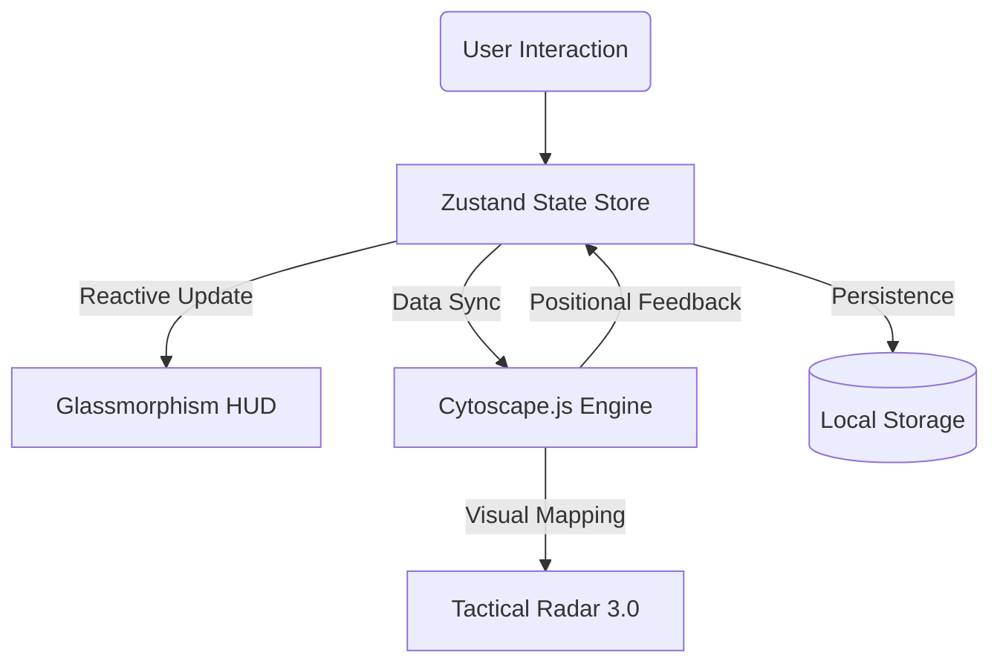

# 🧠 KNOWLEDGE BASE GRAPHS
> **Lead Architect:** Priyanshu Verma  
> **Operational Status:** Live Matix Deployed  
> **Neural Link:** [knowledge-base-graph-mocha.vercel.app](https://knowledge-base-graph-mocha.vercel.app/)

## 🌌 Executive Summary
**Knowledge Base Graphs** is a high-performance, browser-native intelligence mapping platform. Unlike static diagramming tools, it utilizes a real-time graph engine to manage complex relational data, featuring a futuristic "Heads-Up Display" (HUD) powered by glassmorphism and motion-tracked telemetry.

---

## 🏗️ System Architecture
The application logic is built on a "Synchronous Telemetry" pattern where the UI, State, and Graph Engine operate in a continuous feedback loop:



---

## 🚀 Specialized Neural Protocols

### 🛰️ Tactical Radar & Minimap
An advanced geospatial projection system that maps the entire graph topology onto a 2D radar overlay.
- **View-Relative Motion**: blips are calculated based on the viewport's current `zoom` and `pan` vectors.
- **Circular Clipping**: Utilizes polar coordinate normalization to keep distant nodes visible on the radar's edge.
- **Focus Pulse**: Selected neurons emit a radial shockwave on the radar for immediate spatial orientation.

### 🎨 Chromative Branding Manifold
A tactical 12-color palette engineered for high contrast in dark-mode environments.
- **Neon-Glow filters**: Each node color utilizes a specific HSL glow-spread to prevent visual bleeding.
- **Categorical Forge**: Enable distinct visual lanes for different knowledge domains.

### ⚡ Intelligence Flow & Persistence
- **Link Forge**: forge directed edges with semantic metadata labels.
- **Neural Memory**: Every pixel move and color change is automatically cached in real-time, ensuring data survives system reloads.
- **Reboot Matrix**: A gated "Emergency Purge" protocol that clears the neural cache and re-initializes from baseline seed data.

---

## 🛠️ Technology Perimeter

| Layer | Technology | Purpose |
|---|---|---|
| **Core** | Next.js 14 / TS | Typed React framework for robust scalability. |
| **Engine** | Cytoscape.js | Industry-standard graph theory visualization. |
| **Logic** | Zustand | Atomic state management with persistence middleware. |
| **HUD** | Tailwind / Motion | Hardware-accelerated glassmorphism & animations. |
| **Signals** | Sonner | Real-time tactical toast notifications. |
| **Layout** | Dagre | Hierarchical acyclic graph layout engine. |

---

## 🏁 Operational Deployment

### Local Initialization
```bash
# Clone the repository and install dependencies
npm install

# Launch the development matrix
npm run dev
```

### Production Matrix
```bash
# Compile and optimize for production
npm run build
```

---

## 📝 Performance Verification Matrix

| Protocol | Status | Diagnostic Note |
|---|---|---|
| **Nodus CRUD** | ✅ PASS | Full Create/Update/Delete operational. |
| **Edge Forge** | ✅ PASS | Semantic link management verified. |
| **Spatial Sync** | ✅ PASS | Real-time node coordinate persistence. |
| **Radar Feed** | ✅ PASS | Responsive zoom/pan telemetry integration. |
| **HUD Integrity** | ✅ PASS | Glassmorphism & Responsive layout stability. |

---
*Developed by **Priyanshu Verma** as a demonstration of advanced frontend engineering and interactive graph visualization.*
